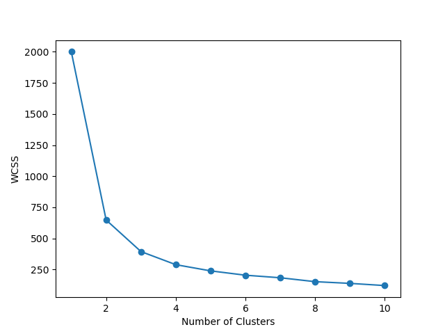
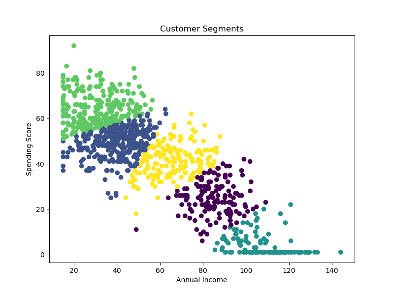

# 👥 Customer Segmentation Analysis

## 📌 Project Overview

This project performs customer segmentation using the K-Means Clustering algorithm to group customers based on purchasing behavior. The analysis helps businesses understand customer patterns and improve marketing strategies.

---

## 🎯 Objectives

- Analyze customer purchasing behavior.
- Determine the optimal number of clusters using the Elbow Method.
- Segment customers into meaningful groups.
- Visualize customer clusters for business insights.

---

## 🛠️ Tools & Technologies

- Python
- Pandas
- NumPy
- Matplotlib
- Scikit-learn
- Jupyter Notebook

---

## 📂 Dataset

The dataset contains customer information, including:

- Customer ID
- Age
- Gender
- Annual Income
- Spending Score

---

## 📈 Project Features

- Data Cleaning and Preprocessing
- Exploratory Data Analysis (EDA)
- Feature Scaling
- Elbow Method for Optimal Clusters
- K-Means Clustering
- Cluster Visualization

---

## 📁 Repository Structure

```
customer-segmentation-analysis/
│
├── README.md
├── CustomerSegmentationAnalysis.ipynb
├── store_customers.csv
├── elbow_method.png
└── cluster_visualization.png
```

---

## 🚀 How to Run

1. Clone this repository.

```bash
git clone https://github.com/bhavyat-23/customer-segmentation-analysis.git
```

2. Install the required libraries.

```bash
pip install pandas numpy matplotlib scikit-learn
```

3. Open `CustomerSegmentationAnalysis.ipynb` in Jupyter Notebook.

4. Run all cells to reproduce the analysis and clustering.

---

## 📊 Results

### Elbow Method



### Customer Clusters



---

## 📌 Key Insights

- Identified the optimal number of customer segments using the Elbow Method.
- Grouped customers based on purchasing behavior using K-Means Clustering.
- Visualized distinct customer segments to support targeted marketing strategies.

---

## 📚 Skills Demonstrated

- Data Cleaning
- Exploratory Data Analysis (EDA)
- Feature Engineering
- Machine Learning
- K-Means Clustering
- Data Visualization
- Business Analytics

---

## 👤 Author

**Bhavya Tagadia**

GitHub: https://github.com/bhavyat-23
